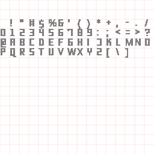

Bangle.js App Loader (and Apps)
================================
Fork to host my apps.

Original readme [here](README_ORIGINAL.md).

New content
===
- SPH Clock [clock]
- SPH Weather [app]
- SPH Calendar [app]
- Font LECO 1976 Regular [module]

# SPH Clock

Hacky clock for my bangle.js 2, with a "vintage menu kind of 50s" look. [App code](apps/sphclock).

# SPH Weather

Simple weather forecast app with graphs for temperature and prob. of rain. [App code](apps/sphweather).

# SPH Calendar

Simple calendar with a vintage menu style. [App code](apps/sphcalendar).

# Font LECO 1976 Regular

Module for font LECO 1976 Regular, with a small adaptation on small sizes, removed serif for better  [Module code](modules/FontLECO1976Regular.js).

Available sizes: 42, 20, 14, 12, 11, 8

