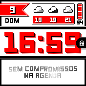
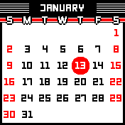
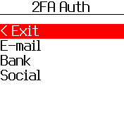
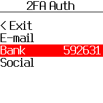
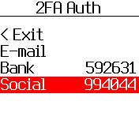
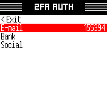
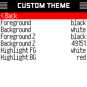

Bangle.js App Loader (and Apps)
================================
Fork to host my apps. 

Loader instance [here](https://diesphink.github.io/BangleApps/).

Original readme [here](README_ORIGINAL.md).

New content
===
- SPH Clock [clock]
- SPH Weather [app]
- SPH Calendar [app]
- SPH 2FA [app]
- SPH Menu [menu]
- Font LECO 1976 Regular [font]

# SPH Clock

Hacky clock for my bangle.js 2, with a "vintage menu kind of 50s" look. [Code](apps/sphclock).

# SPH Weather

Simple weather forecast app with graphs for temperature and prob. of rain. [Code](apps/sphweather).

# SPH Calendar

Simple calendar with a vintage menu style. [Code](apps/sphcalendar).

# SPH 2FA

2FA TOTP generator. Forked and drop-in replacement for the authentiwatch. [Code](apps/sph2fa).

# SPH Menu

Menu replacement with small text, doesn't work well with widgets. [Code](apps/sphmenu).

# Font LECO 1976 Regular

Module for font LECO 1976 Regular, with a small adaptation on small sizes, removed serif for better legibility [Code](apps/leco1976/FontLECO1976Regular.js).

Available sizes: 42, 20, 14, 12, 11, 8

