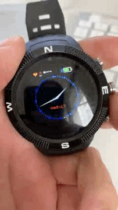

# The One Button tracker

A simple widget that turns the `BTN1` of your Bangle.js into a one-button-tracker that can be used right from the clock face and everywhere else. Record when you're sneezing, yawning, eating, or whatever you think the button should track for you.

## Usage

Every time you press & release the `BTN1` from the clockface this widget will record the time you pressed & released. While you press the button the Bangle will briefly vibrate and the green LED in the display will light up while you're keeping the button pressed.

Once you release `BTN1` both the start & end time of your button press will be saved in 2-column `one_button_presses.csv` CSV file on your _Bangle.js_. The CSV file can [be downloaded from the _My Apps_ tab on the Bangle.js app store](https://banglejs.com/apps/).

To not interfere with alternative usages of `BTN1` (eg when using it for menu navigation) you need to keep the button pressed for at least 130 milliseconds before it triggers a recording (the vibration & LED will inform you about having triggered it).

## Features

- Track whatever events you want with a simple button press on your wrist
- Track multiple things with a single button by using different length of button presses
- Easily export the data to visualize your presses in a tool of your choice

## Controls

Only makes use of `BTN1` (the top one) right now.

## Requests

[Reach out to Bastian](https://www.github.com/gedankenstuecke) if you have feature requests or notice bugs.

## Creator

Made by [Bastian Greshake Tzovaras](https://tzovar.as), inspired by the one-button tracker project by Thomas Blomseth Christiansen and Jakob Eg Larsen.
