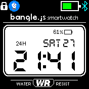

# 93 Dub

Uses many portions from Espruino documentation, example watchfaces, and the waveclk app. It also sourced from Jon Barlow's 91 Dub v2.0 source code and resources and adapted for Bangle.js 2's screen. Time, date and the battery display works. It is not pixel perfect to the original.

Contributors:
* Leer10
* Orviwan (original watchface and assets)
* Gordon Williams (Bangle.js, watchapps for reference code and documentation)
* DiscoMinotaur (adjustments)
* Ray Holder (minor 12 hour time rendering adjustment, fix Thursdays)
