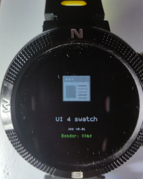
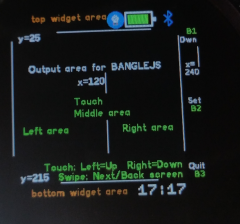

# UI/UX for Espruino Smartwatches

This is a very basic app that defines a common UI/UX for espruino smartwatchesm and specifically for the *bangle.js*, also it displays dinamically calculated x,y position coordinates and screen areas based in detected smartwatch models.

Launcher icon

1st screen - Main page

## Usage

Open and see x,y coordinates for areas
Interact with buttons or touch screen to print the event or leave the app

## Features

Colours, font, user input,, load widgets

## Controls
Press left area - Prints Touch1
Press righ area - Prints Touch2
Press center area - Prints Touch3
Swipe Left - Prints <--
Swipe Right - Prints -->
BTN1 - Prints Button1
BTN2 - Prints Button2
BTN3 - Quit to Launcher

## Support

This app is so basic that probably the easiest is to just edit the code 
Otherwise you can contact me [here](https://github.com/dapgo)