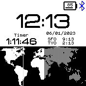

# A Clock with Timer, Map and Time Zones

* Works with Bangle 2
* Timer
  *  Top Right tap: increase by 1 minute
  *  Top Left tap: decrease by 1 minute
  *  Bottom Right tap: increase by 10 minutes
  *  Bottom Left tap: decrease by 5 minutes
  *  Short buzz at T-30, T-20, T-10 ; Double buzz at T
* Other time zones
  *  Showing Paris and Tokyo by default, but you can customize this using the dedicated configuration page on the app store
* World Map
  *  The map shows day and night on Earth and the position of the Sun (yellow line)

 

## Creator
[@alainsaas](https://github.com/alainsaas)
