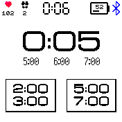
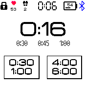
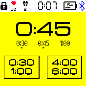
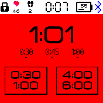

# A Speech Timer

* A timer designed to help keeping your speeches and presentations to time
* Vibrates 1-2-3 times and changes screen color within the target time range.
  *  Example for a 5 to 7 minutes speech: vibrates once at 5:00 (green), twice at 6:00 (yellow), thrice at 7:00 (red).
* Use the buttons to start a timer
* Swipe left or right to choose different target times
* Touching the timer on the upper part of the screen locks (or unlocks) the buttons to prevent accidental changes

## Creator
[@alainsaas](https://github.com/alainsaas)
