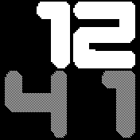

#  AbbelWatch  
---

**AbbelWatch** is a custom watch face project based on the **Numeral App** for the **Bangle.js 2** smartwatch.  
It features a stylish design, multiple fonts, and intuitive gesture controls to enhance your daily smartwatch experience.

---

## ✨ Features

### 🔠 Custom Fonts  
Includes a selection of fonts to personalize your watch face:
- **Bodoni**
- **NumeraLE**
- **NewRocker**
- **Nunito**
- **Teko**

### 👆 Gesture Controls

#### ➡️ Swipe Gestures
- **Swipe Left** → Displays:  
  - Seconds  
  - Step count  
  - Heart rate (BPM)  
- **Swipe Right** → Displays:  
  - Current date  

#### ⬆️⬇️ Drag Gestures
- **Swipe Up** → Shows battery percentage 🔋  
- **Swipe Down** → Activates flashlight mode 💡  

### 📲 Long Press (on screen)  
Opens an interactive **settings menu** with two submenus:

#### 🎨 Color Customization  
Customize the colors of:
- Background  
- Upper digits  
- Lower digits  

#### 🔤 Font Selection  
Choose your preferred font from the list above for a truly personal style.

---
## Creator
bebub123
