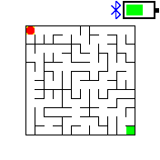

# AccelaMaze

Tilt the watch to roll a ball through a maze.

## Usage

* Use the menu to select difficulty level (or exit).
* Wait until the maze gets generated and a red ball appears.
* Tilt the watch to get the ball into the green cell.

At any time you can click the button to return to the menu.

## Creator

[Nimrod Kerrett](https://zzzen.com)
