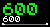
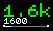
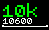

# Active Pedometer

Pedometer that filters out arm movement and displays a step goal progress.

**Note:** Since creation of this app, Bangle.js's step counting algorithm has
improved significantly - and as a result the algorithm in this app (which
  runs *on top* of Bangle.js's algorithm) may no longer be accurate.

I changed the step counting algorithm completely.
Now every step is counted when in status 'active', if the time difference between two steps is not too short or too long.
To get in 'active' mode, you have to reach the step threshold before the active timer runs out.
When you reach the step threshold, the steps needed to reach the threshold are counted as well.

Steps are saved to a datafile every 5 minutes. You can watch a graph using the app.

## Screenshots

* 600 steps

* 1600 steps

* 10600 steps

## Features Widget

* Two line display
* Can display distance (in km) or steps in each line
* Large number for good readability
* Small number with the exact steps counted or more exact distance
* Large number is displayed in green when status is 'active'
* Progress bar for step goal
* Counts steps only if they are reached in a certain time
* Filters out steps where time between two steps is too long or too short
* Step detection sensitivity from firmware can be configured
* Steps are saved to a file and read-in at start (to not lose step progress)
* Settings can be changed in Settings - App/widget settings - Active Pedometer
* Can hide the widget display if required using settings

## Features App

* The app accesses the data stored for the current day
* Timespan is choseable (1h, 4h, 8h, 12h, 16h, 20, 24h), standard is 24h, the whole current day

## Data storage

* Data is stored to a file named activepedomYYYYMMDD.data (activepedom20200427.data)
* One file is created for each day
* Format: now,stepsCounted,active,stepsTooShort,stepsTooLong,stepsOutsideTime
* 'now' is UNIX timestamp in ms
* You can use the app to watch a steps graph
* You can import the file into Excel
* The file does not include a header
* You can convert UNIX timestamp to a date in Excel using this formula: =DATUM(1970;1;1)+(LINKS(A2;10)/86400)
* You have to format the cell with the formula to a date cell. Example: JJJJ-MM-TT-hh-mm-ss

## Settings

* Max time (ms): Maximum time between two steps in milliseconds, steps will not be counted if exceeded. Standard: 1100
* Min time (ms): Minimum time between two steps in milliseconds, steps will not be counted if fallen below. Standard: 240
* Step threshold: How many steps are needed to reach 'active' mode. If you do not reach the threshold in the 'Active Reset' time, the steps are not counted. Standard: 30
* Act.Res. (ms): Active Reset. After how many miliseconds will the 'active mode' reset. You have to reach the step threshold in this time, otherwise the steps are not counted. Standard: 30000
* Step sens.: Step Sensitivity. How sensitive should the sted detection be? This changes sensitivity in step detection in the firmware. Standard in firmware: 80
* Step goal: This is your daily step goal. Standard: 10000
* Step length: Length of one step in cm. Standard: 75
* Line One: What to display in line one, steps or distance. Standard: steps
* Line Two: What to display in line two, steps or distance. Standard: distance

## Releases

* Offifical app loader: https://github.com/espruino/BangleApps/tree/master/apps/activepedom (https://banglejs.com/apps)
* Forked app loader: https://github.com/Purple-Tentacle/BangleApps/tree/master/apps/activepedom (https://purple-tentacle.github.io/BangleApps/#widget)
* Development: https://github.com/Purple-Tentacle/BangleAppsDev/tree/master/apps/pedometer

## Requests

If you have any feature requests, please post in this forum thread: http://forum.espruino.com/conversations/345754/
