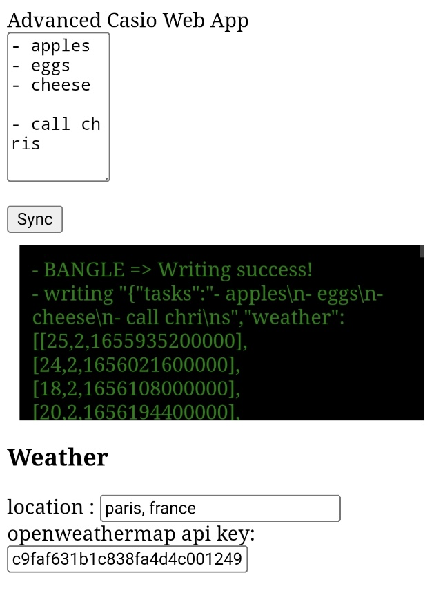

# Adv Casio Clock

An over-engineered clock inspired by Casio watches.
Forked from the awesome Cassio Watch

## Functionalities
- Current time
- Current day and month
- Footsteps
- Battery

- Simple Timer embedded  
- Weather forecast (7 days)
- Scratchpad 

## Screenshots
Clock:

Web interface to update weather & scratchpad 
<a href="https://adv-casio-bangle-updater.herokuapp.com/">https://adv-casio-bangle-updater.herokuapp.com/</a> 

## Usage
### How to update the tasks list / weather
- you need an <a href="https://openweathermap.org/price#weather">free openweathermap.org api key</a> 
- go to https://adv-casio-bangle-updater.herokuapp.com 
  - Alternatively you can install it on your own server/heroku/service/github pages, the web-app code is <a href="https://github.com/dotgreg/advCasioBangleClock/tree/master/web-app">here</a>
- fill the location and the api key (it will be saved on your browser, no need to do it each time)
- edit the scratchpad with what you want
- click on sync
- reload your clock!

### How to start/stop the timer
- swipe up : add time (+5min)
- swipe down : remove time (-5min)
- swipe right : start timer
- swipe left : stop timer

## Code repository (bangle app and web app)
<a href="https://github.com/dotgreg/advCasioBangleClock">https://github.com/dotgreg/advCasioBangleClock</a>

## Creator 
<a href="https://github.com/dotgreg">https://github.com/dotgreg</a>

