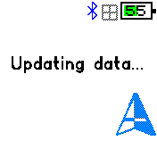
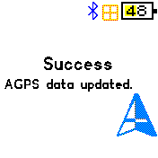

# A-GPS Data

Load assisted GPS data directly to the watch using the new http requests on Android GadgetBridge.

Make sure:
* your GadgetBridge version supports http requests
* turn on internet access in GadgetBridge settings

Currently proof of concept on Bangle2 only. Will eventually add a widget for automatic download. 

## Creator
[@pidajo](https://github.com/pidajo)
