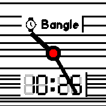

# AI Clock
This clock was designed by stable diffusion ([paper](https://arxiv.org/abs/2112.10752)) using the following prompt:

`A rectangle banglejs watchface`

The original output of stable diffusion is shown here:

My implementation is shown below. Note that horizontal lines occur randomly, but the
probability is correlated with the battery level. So if your screen contains only
a few lines its time to charge your bangle again ;) Also note that the upper text
implements the clkinfo module and can be configured via touch and swipe left/right and up/down.

# Thanks to
The great open-source community: I used an open-source diffusion model (https://github.com/CompVis/stable-diffusion)
to generate a watch face for the open-source smartwatch BangleJs.

## Creator
- [David Peer](https://github.com/peerdavid).