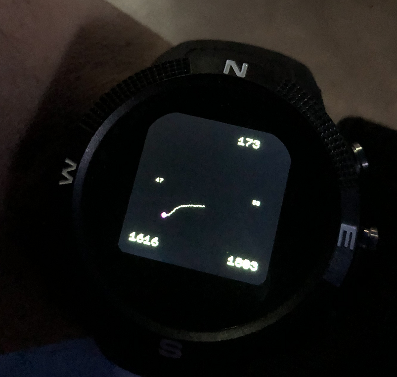

Alpine Navigator
================
App that performs GPS monitoring to track and display position relative to a given origin in realtime.

	[compass 5]

        altitude
[start 1]       [current 2]

        distance
[from start 3]    [track 4]

[btn1 -- screen lock]
[btn2 -- remove points]
[btn3 -- pause]

Functions
---------
Note if you've not used GPS yet, I suggest using one of the GPS apps to get your first fix and confirm, as I've found that helps initially.  

The GPS and magnetometer will be turned on and after a few moments, when the watch buzzes and the dot turns from red to pink, that means the GPS is fixed. All your movements now will be displayed with a line drawn back to show your position relative to the start. New waypoints will be added based on checking every 10 seconds for at least 5 meters of movement. The map will scale to your distance travelled so the route will always remain within the window, the accelerometer/pedometer is not used - this is a purely GPS and compass solution so can be used for driving/cycling etc. A log file will be recorded that tracks upto 1000 waypoints, this isn't a big file and you could remove the limit, but I've kept it fairly conservative here, as it's not intended as a main feature, there's already good GPS recorders for the Bangle. The following other items are displayed:

1. altitude at origin, this is displayed left of the centre.  
2. current altitude, displayed centre right  
3. distance from origin, bottom left (meters)  
4. distance travelled, bottom right (meters)  
5. compass heading, at the top

For the display, the route is kept at a set resolution, so there's no risk of running into memory problems if you run this for long periods or any length of time, because the waypoints will be reduced when it reaches a set threshold, so you may see the path smooth out slightly at intervals.

If you get strange values or dashes for the compass, it just needs calibration so you need to move the watch around briefly for this each time, ideally 360 degrees around itself, which involves taking the watch off. If you don't want to do that you can also just wave your hand around for a few seconds like you're at a rave or Dr Strange making a Sling Ring, but often just moving your wrist a bit is enough.

The buttons do the following:  
BTN1: this will display an 'X' in the bottom of the screen and lock all the buttons, this is to prevent you accidentally pressing either of the below. Remember to press this again to unlock it! Soft and hard reset will both still work.
BTN2: this removes all waypoints aside from the origin and your current location; sometimes during smaller journeys and walks, the GPS can give sporadic differences in locations because of the error margins of GPS and this can add noise to your route.    
BTN3: this will pause the GPS and magnetometer, useful for saving power for situations where you don't necessarily need to track parts of your route e.g. you're going indoors/shelter for some time. You'll know it's paused because the compass won't update it's reading and all the metrics will be blacked out on the screen.

Things to do next
-----------------
There's a GPS widget that's been developed to leverage low-power mode capability on the sensor, will look to incorporate that.
