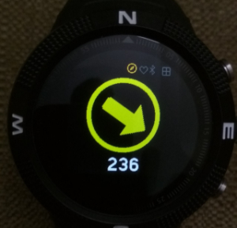

# Arrow Compass

A variation of jeffmer's Navigation Compass.  The compass points
North and shows the current heading.

This is a tilt and roll compensated compass with a linear
display. The compass will display the same direction that it shows
when flat as when it is tilted (rotation around the W-S axis) or
rolled (rotation around the N-S) axis. *Even with compensation, it
would be beyond foolish to rely solely on this app for any serious
navigational purpose.*

## Calibration

Correct operation of this app depends critically on calibration. When
first run on a Bangle, the app will request calibration. This lasts
for 30 seconds during which you should move the watch slowly through
figures of 8. It is important that during calibration the watch is
fully rotated around each of it axes. If the app does give the
correct direction heading or is not stable with respect to tilt and
roll - redo the calibration by pressing *BTN3*. Calibration data is
recorded in a storage file named `magnav.json`.

It is also worth noting that the presence of the magnetic charging
clamps will require the compass to be recalibrated after every
charge.

## Controls

*BTN1* - switches to your selected clock app.

*BTN2* - switches to the app launcher.

*BTN3* - invokes calibration ( can be cancelled if pressed accidentally)

## Issues
* detect when calibration data is missing

## Acknowledgement

This app is based in the work done by [jeffmer](https://github.com/jeffmer/JeffsBangleAppsDev)

Written by: [Hugh Barney](https://github.com/hughbarney) For support
and discussion please post in the [Bangle JS
Forum](http://forum.espruino.com/microcosms/1424/)
