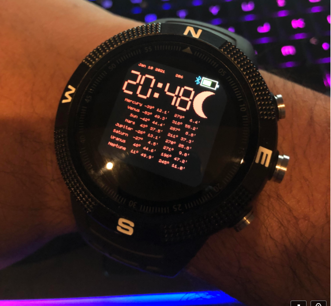

Astral Clock
============
NOTE FOR THE BANGLE 2 THIS APP ONLY SUPPORTS USING THE BLACK BACKGROUND CURRENTLY

Clock that calculates and displays Alt Az positions of all planets, Sun as well as several other astronomy targets (customizable) and current Moon phase. Coordinates are calculated by GPS & time and onscreen compass assists orienting.

  
(The clock does have Pluto now - felt bad for leaving it out)

Functions
--------- 
**BTN2**: Load side-menu as standard for clocks.
Swiping left or right will alternate between planets and other astronomy targets, see below for how to change these addtional ones.

The data is refreshed automatically every 2 minutes. You can force a refresh as well by swiping up or, on Bangle 1, pressing Button 3.

Swiping down will disable/enable the compass and GPS.

When you first install it, all positions will be estimated from UK as the default location and all the text will be white; from the moment you get your first GPS lock with the clock, it will save your location, recalculate accordingly and change the text to red, ideal for maintaining night vision. One the Bangle.JS 2, the colour will be a light blue rather than red because the colours are not as vibrant. The calculations will also now be relevant to your location and time. If you have not used the GPS yet, I suggest using it outside briefly to get your first fix as the initial one can take a bit longer, although it should still just be a minute or 2 max normally.   
Lat and Lon are saved in a file called **astral.config**. You can review this file if you want to confirm current coordinates or even hard set different values \- although be careful doing the latter as there is no error handling to manage bad values here so you would have to delete the file and have the app generate a new one if that happens, also the GPS functionality will overwrite anything you put in here once it picks up your location.

The moon phases are split into the 8 phases with an image for each - new moon would show no image.

The compass is displayed on the left.

Also the compass isn\’t tilt compensated so try and keep the face parallel when taking a reading. It's more of an indicator, for a more accurate compass reading, you can use one of the many great apps in the apploader that compensated for movement and angles of the watch etc.

Additional Astronomy Targets
----------------------------
There are currently 12 extra targets as default in the config file, and these were selected based on well known named objects listed in various sources as good choices for both binoculars and telescopes. The objects are processed and then 9 are displayed and ordered descendingly by altitude on the basis those higher up will have better visibility.

You can input different objects rather than those listed in the galaxies/extras mode by changing the astral.config file with the relevant details for: Object name, Right Ascension and Declination, below is an example. Again, there is little in the way of error handling to streamline the app so be sure to input these in exactly the same format as you see in the file, namely signed 6 digit values with double quotes, example:

*{"name": "Andromeda", "ra": "004244", "de": "411609", "type": 3}*

The type property is not utilised as yet but relates to whether the object is (in order): a cluster, nebula or galaxy. If you try putting more than 12 or so, the clock will try processing all of them but I advise against doing that because you will get memory errors if you put in too many. A better approach is to put a limited set in seasonally based on what's best in your location.

Updates & Feedback
------------------
Put together, initially at least, by \"Ben Jabituya\", https://majorinput.co.uk, jabituyaben@gmail.com.

Credit to various sources from which I have literally taken source code and shoehorned to fit on the Bangle:

-Stephen R. Schmitt:
https://codepen.io/lulunac27/full/NRoyxE

-(Not sure who put this one together initially):
http://www.voidware.com/moon_phase.htm
