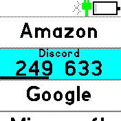
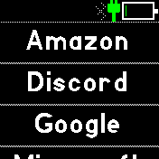
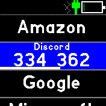

# Authentiwatch - 2FA Authenticator

* GitHub: https://github.com/andrewgoz/Authentiwatch <-- Report bugs here
* Bleeding edge AppLoader: https://andrewgoz.github.io/Authentiwatch/

## Important!

Tokens are stored *ONLY* on the watch. Make sure you do one or more of the following:

* Make a backup copy of the "authentiwatch.json" file.
* Export all your tokens to another device or print the QR code.

Keep those copies safe and secure.

## Supports

* Google Authenticator compatible 2-factor authentication
* Hash calculations:
  * Bangle 1: SHA1 only (same as Google Authenticator)
  * Bangle 2: All (SHA1, SHA256, SHA512)
* Timed (TOTP) and Counter (HOTP) modes
* Custom periods
* Between 6 and 10 digits
* Phone/PC configuration web page:
  * Add/edit/delete/arrange tokens
  * Scan token and migration(import) QR codes
  * Produce scannable token and migration(export) QR codes

## Usage

* Use the Phone/PC web page interface to manage the tokens stored on the watch.
* Tokens are stored *ONLY* on the watch.
* Swipe right to exit to the app launcher.
* Swipe left on selected counter token to advance the counter to the next value.

   

## Creator

Andrew Gregory (andrew.gregory at gmail)
