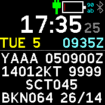
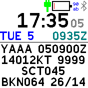

# Aviator Clock

A clock for aviators, with local time and UTC - and the latest METAR
(Meteorological Aerodrome Report) for the nearest airport

This app depends on the [AVWX module](?id=avwx). Make sure to configure that
module after installing this app.

## Features

- Local time (with optional seconds)
- UTC / Zulu time
- Weekday and day of the month
- Latest METAR for the nearest airport (scrollable)

Tap the screen in the top or bottom half to scroll the METAR text (in case not
the whole report fits on the screen). You can also tap the watch from the top
or bottom to scroll, which works even with the screen locked.

The colour of the METAR text will change to orange if the report is more than
1h old, and red if it's older than 1.5h.

To toggle the seconds display, double tap the watch from either the left or
right. This only changes the display "temporarily" (ie. it doesn't change the
default configured through the settings).

## Settings

- **Show Seconds**: to conserve battery power, you can turn the seconds display off (as the default)
- **Invert Scrolling**: swaps the METAR scrolling direction of the top and bottom taps

## Author

Flaparoo [github](https://github.com/flaparoo)

