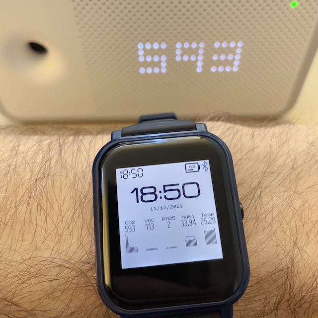

# Awair Monitor

Displays the level of CO2, VOC, PM 2.5, Humidity and Temperature, from your Awair device.

* What you need:
  * A BangleJS 2
  * An Awair device [with local API enabled](https://support.getawair.com/hc/en-us/articles/360049221014-Awair-Local-API-Feature)
  * The web app [awair_to_bangle.html](awair_to_bangle.html) that will retrive the data from your Awair device and sent it to your BangleJS 2 through Chrome's Bluetooth LE connection
* How to get started
  *  Open awair_to_bangle.html with a text/code editor and input the IP address of your Awair on top (const awair_ip_1 = "192.168.xx.xx")
  *  Launch the Awair Monitor app on your BangleJS
  *  Open awair_to_bangle.html on Chrome and click "Connect BangleJS" - it connects to your watch the same way as the Bangle app store
  *  Once connected to the watch with the app running, the watch app is updated once per second

## Creator
[@alainsaas](https://github.com/alainsaas)

Contributions are welcome, send me your Pull Requests!
