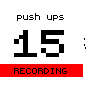

# BanglExercise

Can automatically track exercises while wearing the Bangle.js watch.

Currently only push ups, curls and sit ups are supported.

## Disclaimer

This app is experimental but it seems to work quiet reliable for me.
It could be and is likely that the threshold values for detecting exercises do not work for everyone.
Therefore it would be great if we could improve this app together :-)

## Usage

Select the exercise type you want to practice and go for it!
Press stop to end your exercise.

## Screenshots

## TODO
* Add other exercise types:
   * Rope jumps
   * Star jumps
   * ...
* Save exercise summaries to file system
* Configure daily goal for exercises
* Find a nicer icon

## Contribute
Feel free to send in improvements and remarks.

## Creator
Marco ([myxor](https://github.com/myxor))

## Icons
Icons taken from [materialdesignicons](https://materialdesignicons.com) under Apache License 2.0
