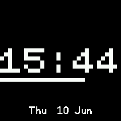
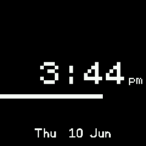

# Bar Clock
A simple digital clock showing seconds as a horizontal bar.

| 24hr style | 12hr style |
| --- | --- |
|  |  |

## Settings
* `Show date`: display date at the bottom of screen
* `Font`: choose between bitmap or vector fonts
* `Power saving`: (Bangle.js 2 only) don't draw the seconds bar while the watch is locked