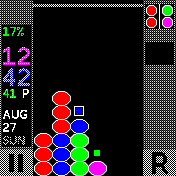
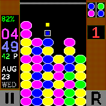

# Bangle Blobs Clock
What if every time you checked the time, you could play a turn of a turn-based puzzle game?
You check the time dozens, maybe hundreds of times per day, and Bangle Blobs Clock wants to add a splash of fun to each of these moments!
Bangle Blobs Clock is a fully featured watch face with a turn-based puzzle game right next to the clock.

## Clock Features
- Hour and minute
- Seconds (only while the screen is unlocked to save power)
- Month, day, and day of week
- Battery percentage. Blue while charging, red when low, green otherwise.
- Respects your 24-hour/12-hour time setting in Locale
- Press the pause button to access your Widgets
- Supports Fast Loading

## The Game
This is a turn-based puzzle game based on Puyo Puyo, an addictive puzzle game franchise by SEGA.
Blobs arrive in pairs that you can move, rotate, and place. When at least four Blobs of the same color touch, they pop, causing Blobs above them to fall.
If this causes another pop, it's called a chain! Build a massive chain reaction of popping Blobs!
- Drag left and right to move the pair
- Tap the left or right half of the screen to rotate the pair
- Swipe down to place the pair

## More Info
If you're confused about the functionality of the clock or want a better explanation of how to play the game, I wrote up a user manual here: https://docs.google.com/document/d/1watPzChawBu4iM0lXypreejs3wvf2_8C-x5V2MWJQBc/edit?usp=sharing

## Special Thanks
I'm Pasta Rhythm, computer scientist and aspiring game developer. I would like to say thank you to the people who inspired me while I was making this app:
- [nxdefiant, who made a Tetris game.](https://github.com/espruino/BangleApps/tree/master/apps/tetris) Bangle Blobs is my first Bangle app and my first time using JavaScript, so this was a daunting project. This Tetris game served as a great example that helped me get started.
- [gfwilliams for Anton Clock](https://github.com/espruino/BangleApps/tree/master/apps/antonclk) and [Targor for Kanagawa Clock.](https://github.com/espruino/BangleApps/tree/master/apps/kanagsec) These were good examples for how to make a watch face for the Bangle.js 2.
- Thanks to Gordon Williams and to everyone who contributes to Espruino and the Bangle.js 2 projects!
- SEGA, owners of the Puyo Puyo franchise that Bangle Blobs is based on. Please check out official Puyo Puyo games!
- Compile, the original creators of Puyo Puyo. The company went bankrupt long ago, but the people who worked for them continue to make games.
