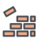

# BrickBreaker

A simple BreakOut clone for the Banglejs

## Usage

Buttons 1 and 3 to move the BrickBreaker!

Button 2 to pause and start the game again.

## Disclaimer

This game was created to learn JS and how to interact with Banglejs, meaning that it may not be perfect :).

Built with love with base on the tutorial: 2D breakout game using pure JavaScript
https://developer.mozilla.org/en-US/docs/Games/Tutorials/2D_Breakout_game_pure_JavaScript

Started on 2020 but rewrote all in 2025 and this is the version I got without having issues with Memory Exhaustion.

And yes, for Bangle 1, old school!

## Creator

Israel Ochoa <isuraeru at gmail.com>