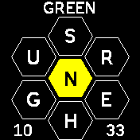

# Spelling bee game

Word finding game inspired by the NYT spelling bee. Find as many words with 4 or more letters (must include the
letter at the center of the 'hive') as you can.

## Usage

 - tap on letters to type out word
 - swipe left to delete last letter
 - swipe right to enter; the word will turn blue while it is being checked against the internal dictionary; once
   checked, it will turn red if the word is invalid, does not contain the central letter or has been guessed before or
   will turn green if it is a valid word; in the latter case, points will be awarded
 - swipe down to shuffle the 6 outer letters
 - swipe up to view a list of already guessed words; tap on any of them to return to the regular game.

## Scoring

The number of correctly guessed words is displayed on the bottom left, the score on the bottom right. A single point
is awarded for a 4 letter word, or the number of letters if longer. A pangram is a word that contains all 7 letters at
least once and yields an additional 7 points. Each game contains at least one pangram.

## Technical remarks
The game uses an internal dictionary consisting of a newline separated list of English words ('bee.words', using the '2of12inf' word list).
The dictionary is fairly large (~700kB of flash space) and thus requires appropriate space on the watch and will make installing the app somewhat
slow. Because of its size it cannot be compressed (heatshrink needs to hold the compressed/uncompressed data in memory).
This file can be replaced with a custom dictionary, an ASCII file containing a newline-separated (single "\n", not DOS-style "\r\n") alphabetically
sorted (sorting is important for the word lookup algorithm) list of words.

