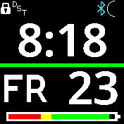

# Big Digit Clock

There are a number of big digit clocks available for the Bangle, but this is
the first which shows all the essential information that a clock needs to show
in a manner that is easy to read by those with poor eyesight.

The clock shows the time-of-day, the day-of-week and the day-of-month, as well
as an easy-to-see icon showing the current charge on the battery.

## Creator

Created by [Deirdre O'Byrne](https://github.com/deirdreobyrne)
