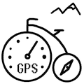

## GPS speed, GPS heading, Compass heading, GPS altitude and Barometer altitude...

...all taken from internal sources.

#### To speed-up GPS reception it is strongly recommended to upload AGPS data with ["Assisted GPS Update"](https://banglejs.com/apps/?id=assistedgps)

#### If "CALIB!" is shown on the display or the compass heading differs too much from GPS heading, compass calibration should be done with the ["Navigation Compass" App](https://banglejs.com/apps/?id=magnav) 

**Credits:** 
Bike Speedometer App by <i>github.com/HilmarSt</i> 
Big parts of the software are based on <i>github.com/espruino/BangleApps/tree/master/apps/speedalt</i> 
Compass and Compass Calibration based on <i>github.com/espruino/BangleApps/tree/master/apps/magnav</i>
