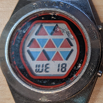

# TheBinWatch

Binary watch to train Your brain
Inspired by the LCD wrist watch from TecRAL from 1989

 

## Usage

- swipe to left or right to change displayed text (date, time, ...)
- currently only available for BangeJs2
- Widgets will not be shown
- If bluetooth connection is not established an icon will show up

## How it works
Binary means that every digit can represent 2 states: 0 or 1, displayed by a black bar.

The principle is the same like in out well known and daily used decimal system with values from 0 to 9:

We start from the most right position with the least significant bit (binary digit) which can have the value 0 or 1
The 2nd bit from the right can have the value 0 or 2 (sum of all bits to the right set to 1 plus 1).
This principle is valid for all the remaining bits.

Mathematically spoken: the value of a digit is the base number of the system (10 for decimal or 2 for binary)
to the power of the position (from the right, starting with 0).
That means in numbers: 2^5 = 32, 2^4 = 16, 2^3 = 8, 2^2 = 4, 2^1 = 2, 2^0 = 1

The upper row represents the hours with 4 bit (2^4 = 16 possible values in total, 12 are used: 1 to 12),
 the 2nd row represents the minutes with 6 bit (2^6 = 64 possible values in total, 60 are used: 0 to 59).
Same holds for the thrid row: 0-59 seconds

To read the values of a row we summ up the vaules of set bits (black bars).
E.g. the picture above, 3rd row (seconds):
101001 
is 1 * 32 + 0 * 16 + 1 * 8 + 0 * 4 + 0 * 2 + 1 * 1
is (only the '1' bit): 32 + 8 + 1 = 41

for the minutes we do the same: 32 + 1 = 33
and the hours: 8 + 2 = 10

So the time is 10:33:41 (that's all)

## TRAIN YOUR BRAIN

Remark: more infos about the original watch including manual can be found here:
https://timeartpiece.com/watches/tech-ral-binary
