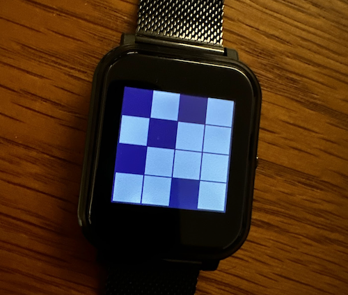

# Block Clock

A clock made from blocks where numbers are overly simplified and barely readable, this clock hopelessly strives for aesthetics rather than utility.

Time is displayed in a grid of 4 numbers…

> **HH  
> MM**

### The digits

Each number is a grid of 4 blocks.

| 0 | 1 | 2 | 3 | 4 | 5 | 6 | 7 | 8 | 9 |
| :---: | :---: | :---: | :---: | :---: | :---: | :---: | :---: | :---: | :---: |
| ⬛⬛ ⬛⬛ | ⬛⬜ ⬛⬜ | ⬛⬜ ⬜⬛ | ⬛⬜ ⬜⬜ | ⬜⬛ ⬛⬜ | ⬜⬜ ⬜⬛ | ⬜⬛ ⬜⬜ | ⬜⬜ ⬛⬛ | ⬜⬜ ⬜⬜ | ⬜⬜ ⬛⬜ |

Example time: 12:34

⬛⬜⬛⬜ ⬛⬜⬜⬛ ⬛⬜⬜⬛ ⬜⬜⬛⬜

## Options

### Beginner mode

Joins the blocks of a digit together.

### Colour mode

Display each digit as a different color.

Example time: 12:34

⬛🟨⬛🟦 ⬛🟨🟦⬛ ⬛🟩🟪⬛ 🟩🟩⬛🟪
