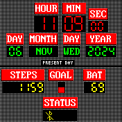

# Back to the future Clock

A watchface inspierd by <a target="_blank" href="https://apps.garmin.com/apps/d181bcf9-5421-42a5-b460-863e5e76d798">this garmin watchface</a>. 

## Todo

- Improving quality of Fonts.
- More status icons.
- A way to change step golas.
- Improving bangle app performances (using functions for images and specialized array).

## Functionalities

- Current time
- Current day and month
- Steps
- Battery
- Step goal
- Bluetooth connected icon

## Screenshots
Clock: 

## Usage

## Links
### code ispired by
advCasioBangleClock <a target="_blank" href="https://github.com/dotgreg/advCasioBangleClock">https://github.com/dotgreg/advCasioBangleClock</a>

93dub <a target="_blank" href="https://github.com/espruino/BangleApps/tree/master/apps/93dub">https://github.com/espruino/BangleApps/tree/master/apps/93dub</a>

### Creator 
<a target="_blank" href="https://github.com/NoobEjby">https://github.com/NoobEjby</a>
