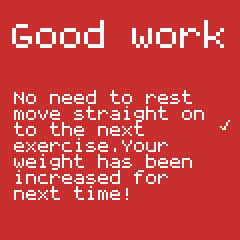

# BuffGym

This gym training assistant trains you on the famous [Stronglifts 5x5 workout](https://stronglifts.com/5x5) program.

## Configuration

### Setting your start weight values

You will want to set your own starting weight values for your 5x5 training program. To do this is easy! After installing this app, go to the BangleJS app store, connect to your watch, and navigate to the `My Apps` tab. In there you will find this app in the list, and an icon (a down arrow) to the right of the app title. Click that icon to reveal a configuration page. Enter your weights and other details, and click upload. That is it, you are now ready to train!

## Usage

### Start screen

When you start the app it will wait on a splash screen until you are ready to start the work out. Press any of the buttons to start

### Workouts menu

You are then presented with the workouts menu, use BTN1 to move up the list, and BTN3 to move down the list. Once you have made your selection, press BTN2 to select the workout.

### Recording your training

You will now begin moving through the exercises in the workout. You will see the exercise information on the display. 

1. At the top is the exercise name, e.g 'Squats'
2. Next is the weight you must train
3. In the center is where you record the number of *reps* you completed (more on that shortly)
4. Below the *reps* value, is the target reps you must try to reach.
5. Below the target reps is the current set you are training, out of the total sets for the exercise.
6. The *reps* value is used to store what you achieved for the current set, you enter this after you have trained on your current set. To alter this value, use BTN1 to increase the value (it will stop at the maximum required reps) and BTN3 to decreas the value to a minimum of 0 (this is the default value). Pressing BTN2 will confirm your reps

### Rest timers

You will then be presented with a rest timer screen, it counts down and automatically moves to the next exercise when it reaches 0. You can cancel the timer early if you wish by pressing BTN2. If it is the last set of an exercise, you don't need to rest, so it lets you know you have completed all the sets in the exercise and can start the next exercise.

### Workout completed

Once all exercises are done, you are presented with a pat-on-the-back screen to tell you how awesome you are.

## Features

* If you successfully complete all reps and sets for an exercise, it will automatically update your weights for next time
* Has a neat rest timer to make sure you are training optimally
* Doesn't require a mobile phone, most 'smart watches' are just a visual presentation of the mobile phone app, this runs purley on the watch. So why not leave your phone and its distractions out of the gym!
* Clear and simple user interface

## Created by

[Paul Cockrell](https://github.com/paulcockrell) April 2020.
