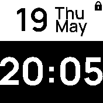

# BW Clock
A very minimalistic clock to mainly show date and time.



## Features
The BW clock provides many features and also 3rd party integrations:
- Bangle data such as steps, heart rate, battery or charging state.
- A timer can be set directly. *Requirement: Scheduler library*
- Show agenda entries. A timer for an agenda entry can also be set by simply clicking in the middle of the screen. This can be used to not forget a meeting etc. Note that only one agenda-timer can be set at a time. *Requirement: Gadgetbridge calendar sync enabled*
- Weather temperature as well as the wind speed can be shown. *Requirement: Weather app*
- HomeAssistant triggers can be executed directly. *Requirement: HomeAssistant app*

Note: If some apps are not installed (e.gt. weather app), then this menu item is hidden.

## Settings
- Screen: Normal (widgets shown), Dynamic (widgets shown if unlocked) or Full (widgets are hidden).
- Enable/disable lock icon in the settings. Useful if fullscreen mode is on.
- The colon (e.g. 7:35 = 735) can be hidden in the settings for an even larger time font to improve readability further.
- Your bangle uses the sys color settings so you can change the color too.

## Menu structure
2D menu allows you to display lots of different data including data from 3rd party apps and it's also possible to control things e.g. to set a timer or send a HomeAssistant trigger.

Simply click left / right to go through the menu entries such as Bangle, Timer etc.
and click up/down to move into this sub-menu. You can then click in the middle of the screen
to e.g. send a trigger via HomeAssistant once you selected it.

```
                    +5min
                      |
  Bangle   -- Timer[Optional] -- Agenda 1[Optional] -- Weather[Optional] -- HomeAssistant [Optional]
    |                 |            |                          |                       |
   Bpm              -5min        Agenda 2                Temperature             Trigger1
    |                              |                          |                       |
  Steps                           ...                        ...                     ...
    |
  Battery
```


## Thanks to
<a href="https://www.flaticon.com/free-icons/" title="Icons">Icons created by Flaticon</a>

## Creator
[David Peer](https://github.com/peerdavid)
