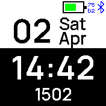

# Black & White clock

In the settings, fullscreen mode can be enabled and disabled:

Additionally, in fullscreen mode a lock icon can be shown...
If you installed the "qalarm" app, you can directly set a timer. Simply tab at
top / bottom of the screen.

## Thanks to
<a href="https://www.flaticon.com/free-icons/lock" title="lock icons">Lock icons created by Those Icons - Flaticon</a>

## Creator
- [David Peer](https://github.com/peerdavid)
