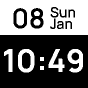

# BW Clock
A very minimalistic clock to mainly show date and time.



## Features
The BW clock provides many features as well as 3rd party integrations:
- Bangle data such as steps, heart rate, battery or charging state.
- A timer can be set directly. *Requirement: Scheduler library*
- Weather temperature as well as the wind speed can be shown. *Requirement: Weather app*
- HomeAssistant triggers can be executed directly. *Requirement: HomeAssistant app*

Note: If some apps are not installed (e.gt. weather app), then this menu item is hidden.

## Menu
2D menu allows you to display lots of different data including data from 3rd party apps and it's also possible to control things e.g. to set a timer or send a HomeAssistant trigger.

Simply click left / right to go through the menu entries such as Bangle, Timer etc.
and click up/down to move into this sub-menu. You can then click in the middle of the screen
to e.g. send a trigger via HomeAssistant once you selected it.

```
                    +5min
                      |
  Bangle   -- Timer[Optional] -- Weather[Optional] -- HomeAssistant [Optional]
    |                 |              |                       |
   Bpm              -5min         Temperature             Trigger1
    |                                |                       |
  Steps                             ...                     ...
    |
  Battery
```

## Settings
- Fullscreen on/off (widgets are still loaded).
- Enable/disable lock icon in the settings. Useful if fullscreen is on.
- The colon (e.g. 7:35 = 735) can be hidden in the settings for an even larger time font to improve readability further.
- There are no design settings, as your bangle sys settings are used.


## Thanks to
<a href="https://www.flaticon.com/free-icons/" title="Icons">Icons created by Flaticon</a>


## Creator
[David Peer](https://github.com/peerdavid)
