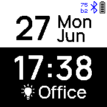

# Black & White clock

## Fullscreen mode
In the settings, fullscreen mode can be enabled and disabled:

## Custom theme
If you switch the light/dark theme on your bangle, the design changes accordingly:

## Show / Hide steps
Optionally, you can hide the steps in the settings.

## Other features
- Lock icon: Show lock icon in fullscreen mode
- Timer: If you installed the "alarm" app, you can directly set a timer. Simply tab at
top / bottom of the screen.

## Thanks to
<a href="https://www.flaticon.com/free-icons/lock" title="lock icons">Lock icons created by Those Icons - Flaticon</a>

## Creator
- [David Peer](https://github.com/peerdavid)
