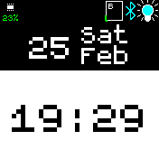

# BW Clock Lite
This is a fork of a very minimalistic clock.

## Features
The BW clock implements features that are exposed by other apps through the `clkinfo` module.
For example, if you install the Simple Timer app, this menu item will be shown if you first
touch the bottom of the screen and then swipe left/right to the Simple Timer menu. To select
sub-items simply swipe up/down. To run an action (e.g. add 5 min), simply select the clkinfo (border) and touch on the item again. See also the screenshot below:

Note: Check out the settings to change different themes.

## Settings
- Screen: Normal (widgets shown), Dynamic (widgets shown if unlocked) or Full (widgets are hidden).
- Enable/disable lock icon in the settings. Useful if fullscreen mode is on.
- The colon (e.g. 7:35 = 735) can be hidden in the settings for an even larger time font to improve readability further.
- Your bangle uses the sys color settings so you can change the color too.

## Thanks to
- Thanks to Gordon Williams not only for the great BangleJs, but specifically also for the implementation of `clkinfo` which simplified the BWClock a lot and moved complexety to the apps where it should be located.
- <a href="https://www.flaticon.com/free-icons/" title="Icons">Icons created by Flaticon</a>

## Creator
[David Peer](https://github.com/peerdavid)

## Contributors
thyttan
