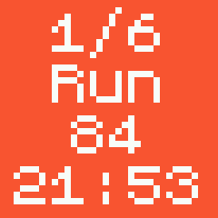

# C25K

Unofficial app for the Couch to 5k training plan.
From being a couch-potato to running 5k in 8 weeks!

Each week has 3 training days, ideally with rest days between them.

Each day's programme consists of running for a certain time with occasional walking/resting phases.  
When walking is part of the programme, the (run+walk) stages are repeated a number of times.  

## Features

- Show remaining time in seconds for each phase  
- Vibrates on phase changes  
- Keeps screen on to allow quickly glancing at the time while running
- Shows time on button press  

## Usage

If you know the week and day of the programme you'd like to start, set `Week` and `Day` to the appropriate values in the main menu and press `Start`.

**Example**:
To start the programme of the **second day** of **week 4**:  

---

Alternatively, you can go to the `View plan` menu to look at all the programmes and select the one you'd like to start.

**Example**:
Go to the `View plan` menu:  

Select the programme to start it:  

---

The format of the `View menu` is `w{week}d{day}(r:{run mins}|w:{walk mins}|x{number of reps})`.  

For example `w6d1(r:6|w:3|x2)` means:  
`it's the programme of day 1 on week 6`,  
`it consists of running for 6 minutes`,  
`followed by walking for 3`,  
`done 2 times back to back`.  

---

### Create a custom excercise

Under the `Custom run` menu, it's possible to create a custom excercise.   

Some important details/limitations:  

- To disable walking: set `walk` to `0`  
- When walking is set to `0`, the repetition count is set to `1`.
- When repetition is set to `2` or higher, `walk` is set to `1`.

**Unfortunately, the value in the menu do not update to reflect the changes, so I recommend setting the values with the rules above in mind.**

---

### Show extra info:

If you ever need to peek at the time, just press the middle (or only) physical button on the watch:  

This view also shows `current rep / total reps` at the top.  

---

### Pause/resume workout:

**This is currently only available on Bangle.js 1.**

Press the top button to pause or to resume the active programme:  

---

## Disclaimer

This app was hacked together in a day with no JS knowledge.  
It's probably inefficient and buggy, but it does what I needed it to do: allow me to follow the C25K programme without a phone.

The app was designed with a Bangle.js 1 in mind, as that's the one I have.  
It *should* work fine on the Bangle.js 2, but I couldn't test it on real hardware.  

---

Made with <3 by [Erovia](https://github.com/Erovia/BangleApps/tree/c25k)
