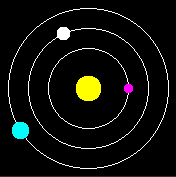

# Astronomy Clock

## Features

* shows earth as hour and venus as minute hand
* shows mercury as second hand only on unlocked screen
* you will be enabled, to recognize the time from the planet positions
* if battery is low, the sun will become a red giant

