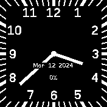

# Analog Clock With 24 hour hands

## Features

* second hand (only on unlocked screen)
* date
* battery percentage (showing charge status with color)
* turned off or swipeable widgets (choose in settings)

## Settings

* whether to load widgets, or not; if widgets are loaded, they are swipeable from the top; if not, NO ACTIONS of widgets are available
* date and battery can be printed both below hands (as if hands were physical) and above (more readable)
* hour hand can be made slighly shorter to improve readability when minute hand is behind a number
