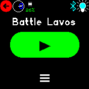
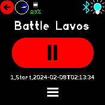
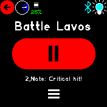
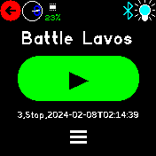
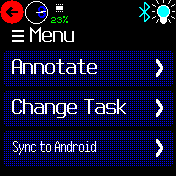
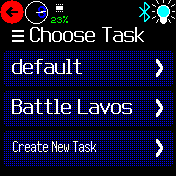
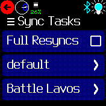

# Chrono Logger

Record times active on a task, course, work or anything really.

**Disclaimer:** No one is responsible for any loss of data you recorded with this app. If you run into problems please report as advised under **Requests** below.

With time on your side and a little help from your friends - you'll surely triumph over Lavos in the end!

      


## Usage

Click the large green button to log the start of your activity. Click the now red button again to log that you stopped.

## Features

- Saves to file on every toggling of the active state.
  - csv file contents looks like:
    ```
    1,Start,2024-03-02T15:18:09 GMT+0200
    2,Note,Critical hit!
    3,Stop,2024-03-02T15:19:17 GMT+0200
    ```
- Add annotations to the log.
- Create and switch between multiple logs.
- Sync log files to an Android device through Gadgetbridge (Needs pending code changes to Gadgetbridge).
- App state is restored when you start the app again.

## Controls

- Large button to toggle active state.
- Menu icon to access additional functionality.
- Hardware button exits menus, closes the app on the main screen.

## TODO and notes

- Delete individual tasks/logs through the app?
- Reset everything through the app?
- Scan for chronlog storage files that somehow no longer have tasks associated with it?
- Complete the Gadgetbridge side of things for sync.
- Sync to iOS?
- Inspect log files through the app, similarly to Recorder app?
- Changes to Android file system permissions makes it not always trivial to access the synced files.


## Requests

Tag @thyttan in an issue to https://gitbub.com/espruino/BangleApps/issues to report problems or suggestions.

## Creator

[thyttan](https://github.com/thyttan)
