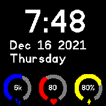

# Circles clock

A clock with circles for different data at the bottom in a probably familiar style

It shows besides time, date and day of week the following information:
  * Steps (requires [pedometer widget](https://banglejs.com/apps/#pedometer))
  * Heart rate (when screen is on and unlocked)
  * Battery

## Screenshot

## TODO
* Show weather information

## Creator
Marco ([myxor](https://github.com/myxor))
