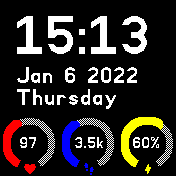
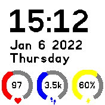
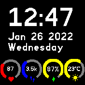
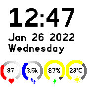
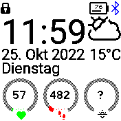

# Circles clock

A clock with three or four circles for different data at the bottom in a probably familiar style

By default the time, date and day of week is shown.

It can show the following information (this can be configured):

  * Steps
  * Steps distance
  * Heart rate (automatically updates when screen is on and unlocked)
  * Battery (including charging status and battery low warning)
  * Weather (requires [OWM weather provider](https://banglejs.com/apps/?id=owmweather))
       * Humidity or wind speed as circle progress
       * Temperature inside circle
       * Condition as icon below circle
       * Big weather icon next to clock
  * Altitude from internal pressure sensor
  * Active alarms (if `Alarm` app installed)
  * Sunrise or sunset (if `Sunrise Clockinfo` app installed)

To change what is shown:

* Unlock the watch
* Tap on the circle to change (a border is drawn around it)
* Swipe up/down to change the gauge within the given group
* Swipe left/right to change the group (eg. between standard Bangle.js and Alarms/etc)

Data is provided by ['Clock Info'](http://www.espruino.com/Bangle.js+Clock+Info)
so any apps that implement this feature can add extra information to be displayed.

The color of each circle can be configured from `Settings -> Apps -> Circles Clock`. The following colors are available:
  * Basic colors (red, green, blue, yellow, magenta, cyan, black, white)
  * Color depending on value (green -> red, red -> green)

## Screenshots

## Ideas
* Show compass heading

## Creator
Marco ([myxor](https://github.com/myxor))

## Icons
Most of the icons are taken from [materialdesignicons](https://materialdesignicons.com) under Apache License 2.0 except the big weather icons which are from
[icons8](https://icons8.com/icon/set/weather/small--static--black)
