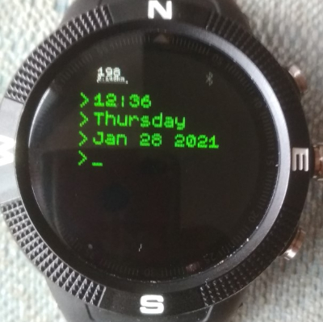
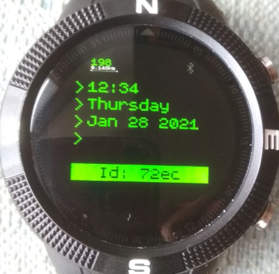

# Cli Clock

A retro VT100 command line style clock

## Screenshots
### Normall face

### With BTN1 pressed

* Successive presses of BTN1 will show Heart rate, Steps, id, FW version, battery %, memory %

* BTN2 shows a functional menu that enables the Heart rate monitor to be turned on / off using BTN1

Once the heart rate monitor is ON, you can cycle through the displays to show the heart rate.

## Future Enhancements
* Ability to turn on the GPS and show, lat long, grid ref
* Maybe a simple stopwatch capability
