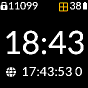
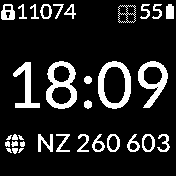
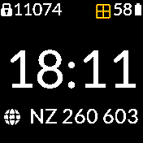
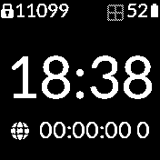

# GPS Clock Info

A clock info that displays the Ordanance Survey (OS) grid reference

- At the start of the walk update the GPS with using one of the AGPS apps. This will
  significantly reduce the time to the first fix.
- I suggest installing the GPS power widget so that you can be assured
  when the GPS is draining power.
- The primary use is for walking where a GPS fix that is 2 minutes old is
  perfectly fine for providing an OS map grid reference.
- Saves power by only turning the GPS on for the time it takes to get a fix.
- In a static test from 100% charge the battery fell to 20% over 48 hours.
- It then switches the GPS off for 90 seconds before trying to get the next fix
- Displays the GPS time and number of satelites while waiting for a fix.
- The fix is invalidated after 4 minutes and will display 00:00:00 0
  or the gps time while the gps is powered on and searching for a fix.
- If the display is shows solid 00:00:00 0 then tap the clkinfo to restart it
  as it will have timed out after 4 minutes
- It is unlikley that this style of gps clock info will work well with the Recorder
  app as that would hold the GPS power permantly on all the time during the
  recording.
- The design is intended to be minimal so if you want to complicate matters
  please fork the app.

## Screenshots

- Above: The GPS is powered on and waiting for a fix.
- The GPS widget shows yellow indicating powered on
- The time from the GPS chip is displayed with the satellite count
- The time from the GPS chip is incrementing approximately every second
- Note the time on the GPS is in UTC and not the current timezone

- Above: The GPS has a fix
- The OS grid reference has been calculated
- The GPS has been turned off for 90 seconds
- The GPS widget is grey showing the GPS is off
- You will not see the GPS widget turn green as the GPS is turned off after a fix

- Above: The GPS has been powered on after 90 seconds and is waiting for a fix

- Above: The GPS has not had a fix for 4 minutes and the cycle has stopped
- The time from the GPS is 00:00:00 0, indicating that the GPS not on
- The GPS widget is grey showing the GPS is off
- Tap the clock_info to restart the GPS clock info

Written by: [Hugh Barney](https://github.com/hughbarney)  For support and discussion please post in the [Bangle JS Forum](http://forum.espruino.com/microcosms/1424/)
