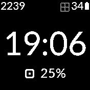

# RAM Clock Info

A clock info that displays the % memory used

## Screenshots

Written by: [Hugh Barney](https://github.com/hughbarney)  For support and discussion please post in the [Bangle JS Forum](http://forum.espruino.com/microcosms/1424/)
