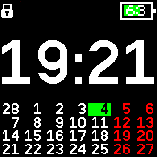
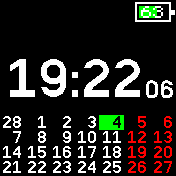
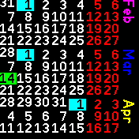

# Clock & Calendar by Michael

This is my "Hello World". I first made this watchface almost 10 years ago for my original Pebble and Pebble Time and I missed this so much, that I had to write it for the BangleJS2.
I know that it seems redundant because there already **is** a *time&cal*-app, but it didn't fit my style.

|Screenshot|description|
|:--:|:-|
||locked: triggers only one minimal update/min|
||unlocked: smaller clock, but with seconds|
||swipe up for big calendar ⬆️/⬇️ to scroll   ⬅️/➡️ to exit|

## Configurable Features
- Number of calendar rows (weeks)
- Buzz on connect/disconnect (feel free to disable and use a widget)
- Clock Mode (24h/12h). (No am/pm indicator)
- First day of the week
- Red Saturday/Sunday
- Swipe/Drag gestures to launch features or apps.

## Integrated swipe launcher: (Configure in Settings)
- ⬇️ (down) will search your files for an app with the string "**message**" 
- ➡️ (right) will search your files for an app with the string "**music**" 
- ⬅️ (left) will search your files for an app with the string "**agenda**"
- ⬆️ (up) will show the **internal full calendar**

## Feedback
If something isn't working, please tell me: https://github.com/Stuff-etc/BangleApps/issues (I moved my github repo)

## Planned features:
 - Internal lightweight music control, because switching apps has a loading time.
 - Clean up settings
 - Maybe am/pm indicator for 12h-users
 - Step count (optional)
