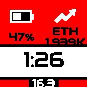
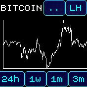
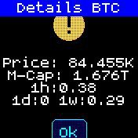
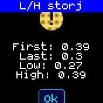

# Crypto-Coin Info

Crypto-Coins Infos with the help of the Binance and CoinStats API

## Description

- Is a clock_info module and an app
- I use Pebble++ watch to show a bigger size of clock_info
- I use a wider, more readable font for Pebble++
- Upload data via App-Loader interface first!!!

## Creator

Martin Zwigl

## Parts Infos

### App-Loader web-interface

- Binance
  - Find docs here [Binance API](https://www.binance.com/en/binance-api)
  - For Binance use symbols like BTC,ETH,STORJ 
  - For the calc counterpart use USDT (I don't know why USD is measured on the stablecoin) or EUR or other fiat currency
- Coinstats
  - Find docs here [Coinstats API](https://openapi.coinstats.app/)
  - Get an API key at the website. Free is worth 1Mio token, which in turn is worth around 250k - 300k requests per month
  - Supply crypto token in the form of its IDs like bitcoin,ethereum,storj
- It is not necessary to re-upload the app when uploading data. Data is read with app start

### Clock-Info

- Updates prices with the free Binance API
- clkInfo updates after around 15 sec and then every x minutes (via settings) thereafter.
- The token you want to have tracked and compared to what currency have to be uploaded via app loader web-interface
- After that you can decide which token to display in settings

### App

- Using CoinStats for chart-data
- token-names on CoinStats are different to Binance; they also have to be uploaded via Interface
- You also need a CoinStats API access key which is good for a fair amount of calls
- I tried with gridy for the axis, but for this data - it is just not readable...
- Let me know when you have good suggestions for improvement.
- ".." button shows current details for current token
- "LH" button shows low and high on graph as well as the first and last point in series
- Swipe L-R changes token you supplied via interface
- Not much guard-rails in the app -> you should have at least one token (each) present
- Also the API token and fiat currency you want to match against (eg. USD, EUR)
- New data is requested every minute, except on button touch

### Settings

- Choose which of the uploaded tokens to display in clock_info
- Choose update-time for clock_info HTTP requests to Binance

## Possible Improvements / TODOs

- Better choosing of fonts for more space
- set UI properly to have back button next to widgets
- clean-up code structure