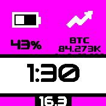

# Crypto-Coin Info

Crypto-Coins Infos with the help of the Binance and CoinStats API

## Description

- Is a clock_info module and an app
- I use Pebble++ watch to show a bigger size of clock_info
- I use a wider, more readable font for Pebble++

## Creator

Martin Zwigl

## Parts Infos

### Clock-Info

- Updates prices with the free Binance API
- clkInfo updates after around 15 sec and then every x minutes (via settings) thereafter.
- The token you want to have tracked and compared to what currency have to be uploaded via app loader web-interface
- After that you can decide which token to display in settings

### App

- Using CoinStats for chart-data
- token-names on CoinStats are different to Binance; they also have to be uploaded via Interface
- You also need a CoinStats API access key which is good for a fair amount of calls
- I tried with gridy for the axis, but for this data - it is just not readable...
- Let me know when you have good suggestions for improvement.