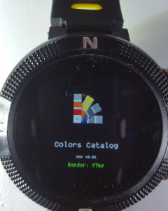
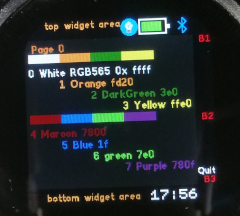
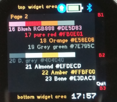

# Color Catalog

This is a very basic app that displays RGB565 and RGB888 colors, its name and code in screen.
This apps is based in the "common UI/UX".

Launcher icon

1st screen - page 1

2nd screen - page

## Usage

Open and 2 rows of colors per page 
Interact with a horizontal swipe/slide to move to next or previos page in order to display other colors

## Features

Colours, font, user input, load widgets

## Controls
Press left area - 
Press righ area - 
Press center area - 
Swipe Left - Load the previous page and its colors
Swipe Right - Load the next page and its colors
BTN1 - Prints Button1
BTN2 - Prints Button2
BTN3 - Quit to Launcher

## Support

This app is so basic that probably the easiest is to just edit the code 
Otherwise you can contact me [here](https://github.com/dapgo)