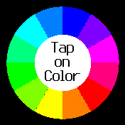
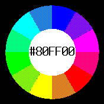

# ColorWheel #

Choosing the right color on a Bangle.js 2 is not always easy. This little app therefore displays a wheel of rather good looking colors and reveals the associated color code by tapping on it

Please note: you may also tap outside the wheel (for black) or inside it (for white).

## License ##

[MIT License](LICENSE)
