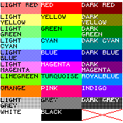

# Colours Demo

This is a simple app to demonstrate colours on a Bangle 2.

The colours are "optimised" for the Bangle 2's 3-bit display. They only include values which use either the full, half or no primary RGB colour, which should reduce the artifacts due to dithering (the exception are light and dark grey).

Use this app for choosing colours for your own project, and copy the colour definitions from the source code.

## Use colours in other projects

Copy-and-paste the colour constants to be used in your own app from `coloursdemo.app.js`. They are sandwiched between the "BEGIN" and "END" comments at the beginning of the file.

With the constants available in your own code, you can for example set the foreground colour to yellow with:

	g.setColor(COLOUR_YELLOW);

This works for any graphics call requiring a colour value (like `g.setBgColor()`).

